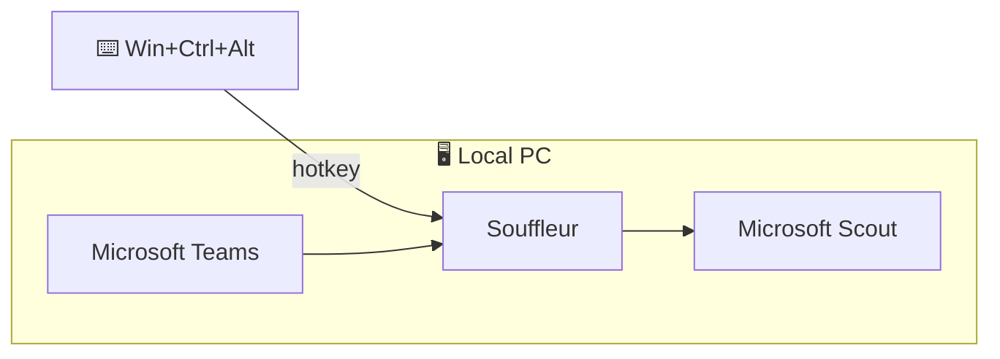

# Souffleur

Souffleur (French *souffleur* — a theatre prompter) — local, real-time **Microsoft Teams
live-caption** capture for Windows. It saves every meeting transcript to disk and, on a
single hotkey, **pushes the live transcript to Microsoft Scout (Clawpilot)** for fast,
in-context answers while you talk.



- ✅ 100% local — no bot, no meeting join, no Graph, nothing uploaded anywhere
- ✅ Invisible to the tenant — it only *reads text already rendered on your screen*
- ✅ Captures only an active call window, ignoring ordinary Teams chats
- ✅ Saves each meeting to `~/.souffleur/YYYY-MM-DD-HH-MM-MEETING.md`

## Install

### 1. Windows installer (recommended, no Python needed)

Download **`souffleur-setup.exe`** from the
[**Releases page**](https://github.com/iakov-gan/souffleur/releases/latest) and run it —
per-user, no administrator rights, adds Start Menu shortcuts.

Prefer no installer? Grab **`souffleur-windows.zip`** from the same page, unzip, and run
`souffleur.exe`. Both bundle their own Python runtime.

### 2. Python (pip)

Requires Python 3.10+.

```powershell
pip install -U git+https://github.com/iakov-gan/souffleur.git
```

This installs the `souffleur` command (`python -m souffleur` works too).

## Quick start

1. Join a Teams meeting and turn on live captions
   (**More (…) → Language and speech → Turn on live captions**). Souffleur also tries to
   enable them for you.

   

2. Run `souffleur`. The transcript streams to the console and is saved to `~/.souffleur`.
   Press **Ctrl+C** to quit.

3. To push the transcript to Clawpilot, enable the integration (below) and press
   **Win+Ctrl+Alt** whenever you want an answer.

## Commands

```powershell
souffleur                     # default: run the daemon (capture + save)
souffleur run -c my.toml      # custom config (./config.toml is auto-created)
souffleur run --clawpilot     # enable Clawpilot sending for this run
souffleur doctor              # one-line readiness check
souffleur discover [--tree]   # list windows + caption region (or dump the UIA subtree)
souffleur capture             # tail captions to stdout, e.g. `souffleur capture > out.txt`
souffleur --help              # full option reference
```

`doctor` should report `Caption region : OK`. `capture` sends finalized lines
(`[HH:MM:SS] Speaker: text`) to stdout and status to stderr; useful flags are
`--interval`, `--timeout`, `--show-live`, `--no-auto-enable`, `--container-name`,
`--container-aid`, `--depth`.

Transcripts are written continuously, one file per meeting (named from the start time and
Teams window title). Restarting mid-meeting resumes the same file without duplicating
replayed caption lines.

## Clawpilot integration

Off by default. Enable it with `clawpilot.enabled = true` in `config.toml`, or per run
with `souffleur run --clawpilot`.

1. Open **Clawpilot** and prime the chat once with your persona, e.g. *"You are an expert
   interviewer; read the transcript and suggest the best next answer."*
2. Start Souffleur — it launches Clawpilot if needed, brings it to the front, and
   registers the hotkey.
3. Press **Win+Ctrl+Alt** (a one-handed bottom-left chord that avoids the Ctrl+Shift
   language switcher). Only lines added since your last press are pasted and sent; the
   answer streams back in Clawpilot.

Notes: the in-progress caption line is included, so mid-sentence presses still work.
If Clawpilot is mid-answer the press is held and sent once it goes idle — the in-flight
answer is never cancelled. Your clipboard is restored after pasting, and Clawpilot is
brought to the foreground to send (fine when you share a *window*, not the full screen).

## Configuration (`config.toml`)

Auto-created with defaults on first run; override the path with `-c/--config`.

| Section / key | Default | Meaning |
|---|---|---|
| `hotkey.combo` | `win+ctrl+alt` | Global trigger, `+`-separated (`ctrl+f8`, `win+ctrl+alt+z`). A modifier-only chord fires once per hold. |
| `hotkey.window` | `0.25` | Seconds tolerance for a "rolling" press. Raise if presses get missed. |
| `clawpilot.enabled` | `false` | Enable hotkey sending to Clawpilot. |
| `clawpilot.exe` | `auto` | App to launch; auto-detects PATH, Program Files, per-user installs, App Paths. |
| `clawpilot.window_title` | `Clawpilot` | Window title match (case-insensitive substring). |
| `clawpilot.foreground_on_start` | `true` | Bring Clawpilot to front at startup. |
| `send.mode` | `delta` | `delta` (new lines only) or `full`. |
| `send.max_chars` | `12000` | Payload cap; oldest lines trimmed. |
| `send.include_live` | `true` | Include the not-yet-finalized caption line. |
| `send.restore_clipboard` | `true` | Restore prior clipboard after pasting. |
| `send.wait_for_idle` | `true` | Hold the press while Clawpilot is generating instead of dropping it. |
| `send.idle_timeout` | `90.0` | Give up a held press after this many seconds. |
| `send.retry_interval` | `1.0` | Seconds between idle-check retries. |
| `send.template` | `Here is a transcript…{payload}…` | `{payload}` is replaced with the transcript. |
| `capture.interval` | `0.5` | Transcript polling interval (seconds). |
| `capture.auto_enable` | `true` | Turn Teams captions on via `Alt+Shift+C`, falling back to menu automation. |
| `capture.save` | `true` | Save the transcript continuously. |
| `capture.directory` | `~/.souffleur` | Where transcripts are written. |
| `watchdog.interval` | `5.0` | Seconds between Clawpilot alive checks. |

## How it works

New Teams is a WebView2 (Chromium) app, so its DOM is exposed through UI Automation.
Souffleur finds the meeting window, locates the **Live Captions** region, and reads each
caption entry. Region detection is **language-independent**: if Teams localizes the label,
it falls back to the lowest common ancestor of the caption elements. The last visible line
is treated as "live" and earlier lines are finalized once a newer one appears below them,
de-duplicated as it goes. The region is re-acquired automatically if reads dry up (a
language change or panel toggle rebuilds the subtree).

If a Teams update changes these element names, run `souffleur discover --tree` and pass
`--container-name` / `--container-aid` explicitly.

## Development

```powershell
.\build.ps1
```

Creates `dist\souffleur-windows.zip` (`souffleur.exe` + Python runtime) and, with Inno
Setup 6 installed, `dist\souffleur-setup.exe`. GitHub Actions builds and tests both for
every release.

## Limitations

- Souffleur reads Teams' captions; it does not transcribe audio itself, so accuracy is
  whatever Teams produces. For a Teams-independent alternative, capture loopback audio
  (WASAPI) and run a local STT model such as whisper.cpp.
- Element names are Teams-version dependent (see [How it works](#how-it-works)).

## ⚠️ Before you use it

Capturing/transcribing a meeting can require the consent of participants and may be
governed by law and by your organization's policy. **You are responsible for confirming
you are allowed to capture a given meeting.**
